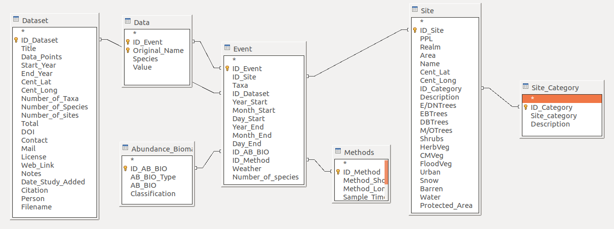
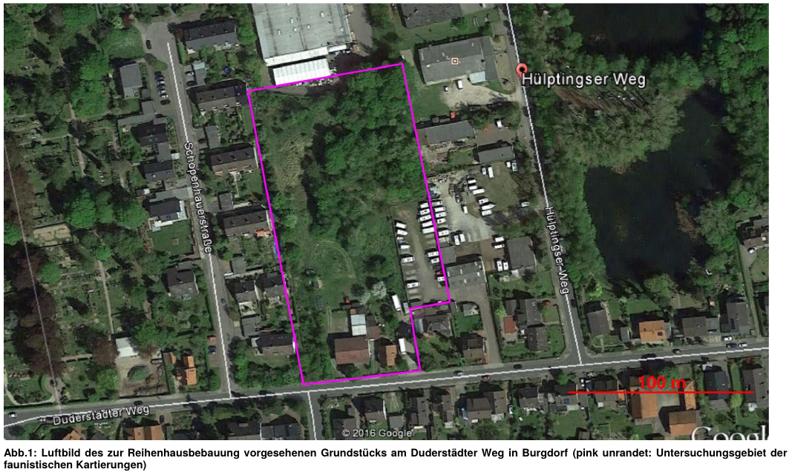

# SPARSE - SPecies AcRoss ScalEs

Authors: **Clara Rosse** & **Petr Keil**

Email: pkeil@seznam.cz

Originally created: August 2020, iDiv, Leipzig

Updated: Apr 15 2021

Acknowledgements: Big thanks to **Jonathan M. Chase** who supported us and generously funded this during summer 2021 when we conceived the idea.

-------

**Description:**

This is a first outline of SPARSE database which stores biodiversity surveys
conducted in multiple types of geographic units/objects. These objects are: reserve inventories,
point surveys, transects, commercial surveys prior to construction activities, checklists and redlists in administrative units such as counties, states, or countries.

The core of the database is so far implemented in **LibreOffice BASE** since it is free and user friendly. Plus, there is an associated a set of folders and files.

-------


**Structure of the folder:**

```\Sites``` - folder cotaining the spatial `.kmz` objects (Google Earth). We chose this format because it is extremely easy to input, and it doesn't require any GIS knowledge whatsoever. 

```\Studies``` - folder with the original studies (`.pdf` and other files) from which the data were extracted.

```SPARSE.odb``` - the main LibreOffice BASE file.. 

```notes on german birds.txt``` - Clara's experiences from inputting the data

```google_terms.txt``` - search terms that Clara used when looking for the studies

```birds_checklists_input_table_and_taxonomy.xlsx``` - an Excel spreadsheet used to process the data

-------

**Structure of the database**

We got inspired by [BioTIME](https://onlinelibrary.wiley.com/doi/full/10.1111/geb.12729) and GBIF's [Darwin Core](https://dwc.tdwg.org/). Plus there are some our ideas in the mix. Detailed description of fields and tables is in the database itself.

 

**Figure 1:** A screenshot of the structure (Apr 15 2021):

-------

 

**Figure 2**  An example of sub-urban location that was surveyed for birds prior to a construction. These ecological surveys related to construction and landscape planning are abundant in Central Europe, are publicly accessible, contain well described methodology, and are mobilized as part of SPARSE. The map here is from a “Faunisticher Fachbeitrag” in Burgdorf, Lower Saxony, Germany, available at https://bit.ly/3wtyeAe. 


