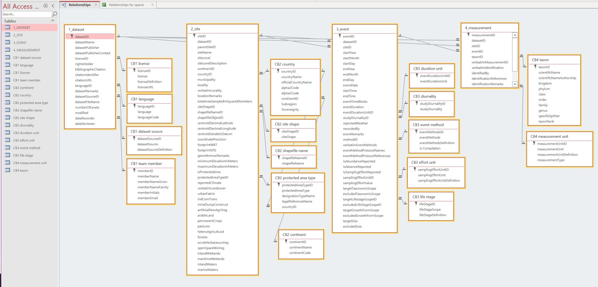

# SPARSE - SPecies AcRoss ScalEs

**Authors since 2021 (at CZU):** Petr Keil, Eva Trávníčková, Kateřina Tschernosterová, Florencia Grattarola

**Authors 2020 (at iDiv):** Petr Keil, Clara Rosse 

**Email:** pkeil@seznam.cz

-------

## Description

**This is SPARSE database, it stores data on species composition of sites in space and through time, where multiple species had been recorded during the surveys.** Thus, SPARSE does *not* contain presence-only point observations such as those stored in e.g. GBIF. Examples of data stored in SPARSE are reserve inventories, point surveys, transects, commercial surveys prior to construction activities, checklists and redlists in administrative units such as counties, states, or countries. SPARSE is currently implemented in **MS Access**, with additional GIS data stored in **ESRI shapefiles**, and with the original raw data provided as .pdf and .xlsx files. 

### Long-term goals

- To create infrastructure for management of "inventory" data in our research group, with emphasis on temporal change and data heterogeneity.
- The database should have **simple** structure, so that others can use it or copy it, without a detailed knowledge of databases or spatial data.
- The database structure should work for **different groups of organisms**, and in different regions of the world.
- For our group, to **learn basics of biodiversity databases**, standards, and spatial data management.
- To actually have the data for selected groups and regions. The first priority is to digitize data on Central European Birds, so that they can complement other data that we have for this taxon and region.
- To create a backbone for a **bigger database of heterogeneous biodiversity data covering Europe, United States, and potentially other regions**.

### What makes SPARSE unique?

- It is **open, free, and simple**.
- It emphasizes quality of data over quantity.
- It is spatially explicit, and can accommodate **complex spatial structures and multiple scales**, including complex nested sampling designs where multiple sites within a larger area have been surveyed, and this larger area can again be nested in an even larger region. 
- It works well with data on **temporal change**.
- It explicitly considers variation in **sampling methods and effort**, it should work for **different regions and taxa**.
- It is inter-operable, as it uses a combination of **Humboldt core** and **Darwin core standards**.
- Apart from nature reserves and "nice" intact natural locations, SPARSE also has other sites, e.g. those heavily modified by humans.
- Sites in SPARSE are prioritized to minimize spatial, temporal, and environmental bias (e.g. using stratified random sampling of all potentially available datasets).

------------

## Progress summary

The very first template was originally created in August 2020, at iDiv, Leipzig, by Petr Keil & Clara Rosse, with the backing of Jonathan M. Chase. In the fall of 2021, new effort had started at the Department of Spatial Sciences at Czech University of Life Sciences in Prague, where Petr Keil relocated to start his tenure-track position. During summer and fall 2021 we have (with Eva Trávníčková, Kateřina Tschernosterová, and Flo Grattarola) completely overhalued the structure, matched the standard with Darwin Core and Humboldt core, and migrated it to MS Access. We also started digitisation of Czech bird communities.

--------

## Structure of the folder

`/`

&nbsp `sparse.accdb` - the main database file

&nbsp `/code` - all scripts that we have been using to process the data 

&nbsp `/data` - the raw data, including original .pdf file of publications from which we extracted the data, and other intermediate files

&nbsp `/docs` - various documentation

-------

# Figures

 

**Figure 1:** A screenshot of the structure (May 17 2022):

 

**Figure 2**  An example of sub-urban location that was surveyed for birds prior to a construction. These ecological surveys related to construction and landscape planning are abundant in Central Europe, are publicly accessible, contain well described methodology, and are mobilized as part of SPARSE. The map here is from a “Faunisticher Fachbeitrag” in Burgdorf, Lower Saxony, Germany, available at https://bit.ly/3wtyeAe. 

-------

## Acknowledgements

Big thanks to **Jonathan M. Chase** who supported us and generously funded this during summer 2020 when we conceived the idea. Since the fall of 2020, Petr Keil has been supported by funding from Research Excellence in Evnironmental Sciences (REES) provided by Czech University of Life Sciences.

